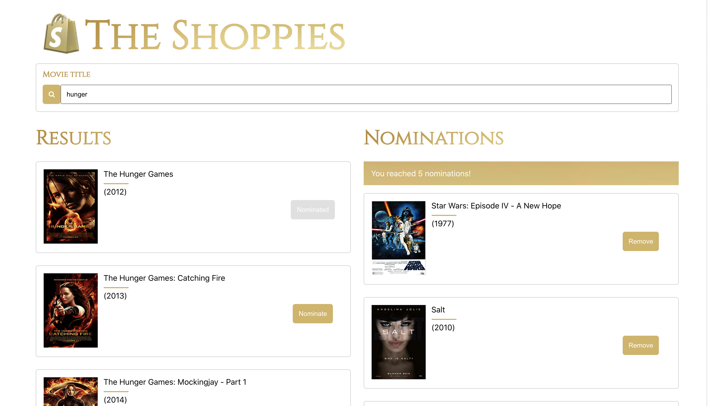

# The Shoppies

## Hosted On: https://tiffanyluu-the-shoppies.netlify.app/

### Description

Shopify is hosting its very own movie awards event, The Shoppies. They are decking out
in all things gold and glamorous! Help Shopify give out golden Shoppies by browsing the site and
nominating your favorite movies.

### Technologies
* React
* HTML/CSS

### Features
In addition to the requirements listed, I improved the design to include:
* Movie poster
* Improving the UI by adding gold theme
* Displaying results and nominations as a separate component instead of as a list
* Local storage to save nominations after user leaves page
* Ensuring responsive webdesign

### Challenges
* Prior to The Shoppies, I had relied heavily on Bootstrap for styling. I decided to challenge myself
to use plain CSS, and in doing so gained a much better understanding of flexbox and responsive design. 

### Preview 

